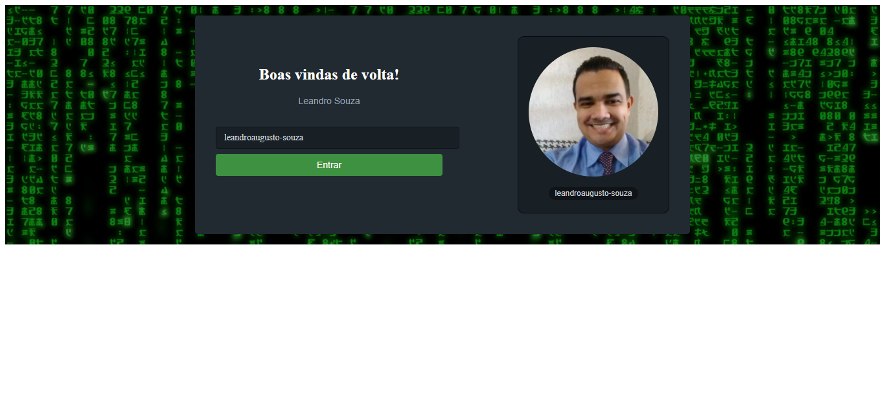
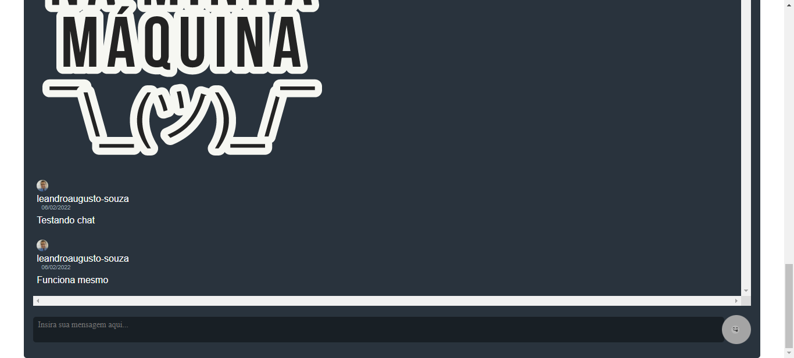

# WEBAPP DESENVOLVIDO EM REACT E NEXT.JS

Um Webapp de chat desenvolvido em parceria com a Alura, usando todo o poder do React e Next.Js.

Para o Backend foi utilizado o Baas Supabase.

## Imagens do App

 

## Feito Com:

## 🔖 Licença

### Support Ou Contato

Copyright © 2022 leandroaugusto-souza

